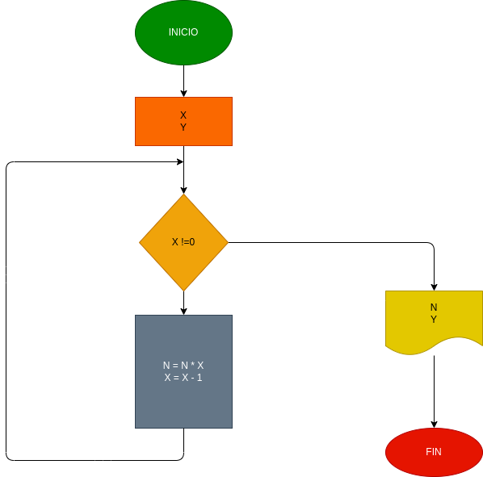

# Programa para calcular un entero positivo y calcular su factorial

## Hacer el diagrama de flujo y el programa en python que lea un número n, entero y positivo, y que le calcule su factorial y que lo imprima junto con el número leído.

Robert Caicedo Sánchez
Juan pablo Herrera Baquero